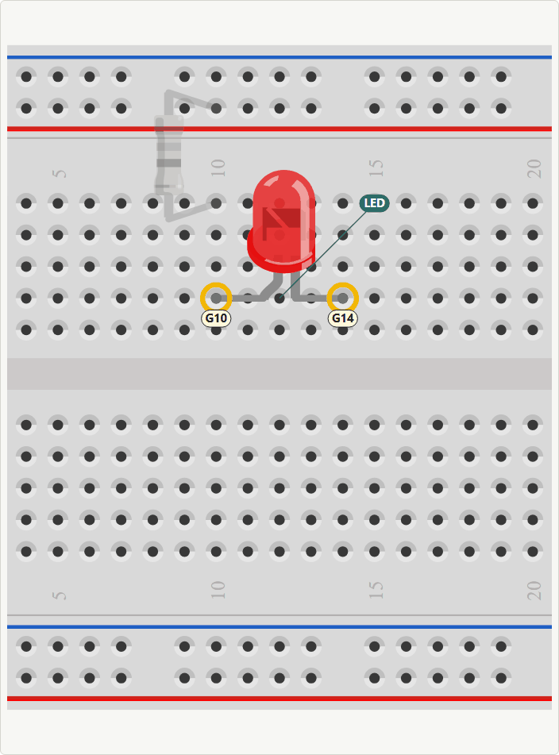
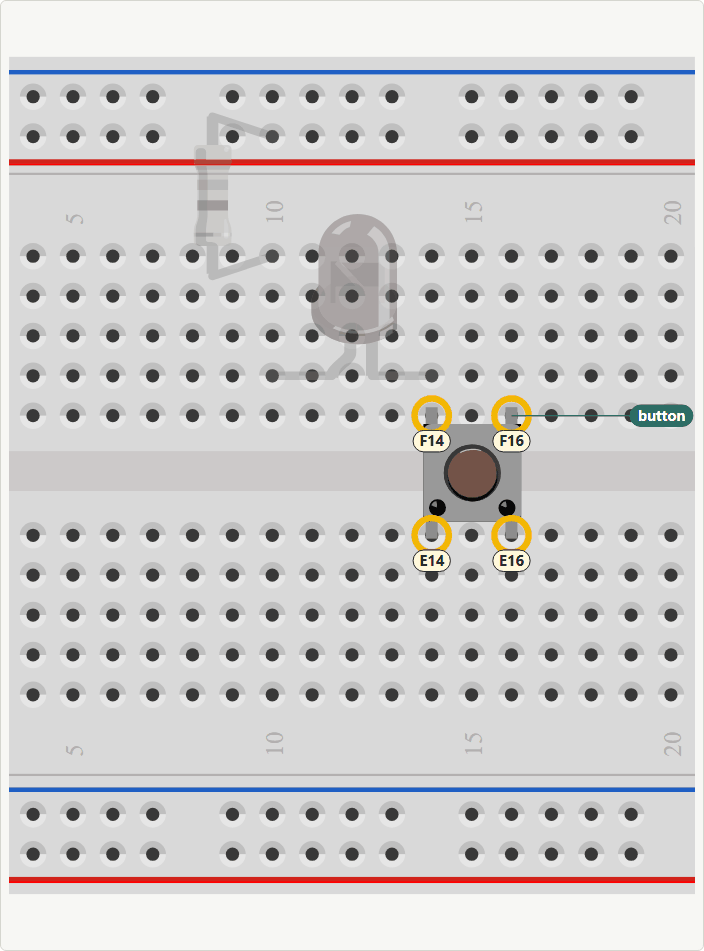

# breadboard-pictures

A Claude Code skill for step-by-step breadboard build pictures. Each picture shows one
action: the part being placed, in colour, with its holes circled and named (`B23`, "top + rail"),
and everything placed earlier in grey.

The part drawings come from the [Fritzing parts library](https://github.com/fritzing/fritzing-parts),
about 2,100 parts, fetched on demand. The skill reads leg positions and connected holes from the
library's own part files, so any part with a breadboard drawing can be placed.

<p>
  
  
</p>

*Two consecutive steps from `assets/template.html`. Part and breadboard drawings: [Fritzing parts library](https://github.com/fritzing/fritzing-parts), CC BY-SA 3.0; these two images are CC BY-SA 3.0 as well.*

## Install

Clone it into your Claude Code skills folder:

```sh
git clone https://github.com/TheJackFace/breadboard-pictures ~/.claude/skills/breadboard-pictures
```

Claude Code picks it up in the next session. Ask for breadboard build steps, or name the skill.

## What's in it

| File | What it does |
|---|---|
| `SKILL.md` | the workflow the agent follows |
| `REFERENCE.md` | hole names and the part spec format |
| `scripts/fritzing.mjs` | `sync`, `search`, `show`, `bundle`: find parts, copy their drawings into a project |
| `scripts/snap.mjs` | screenshot a page with headless Chrome/Edge/Chromium; reports hole clashes and misplaced pins |
| `assets/breadboard.js` | the renderer (browser, no dependencies) |
| `assets/template.html` | a starting page |

Requirements: Node 18+, git, and a Chromium-based browser for screenshots.

## Licences

- **This skill** (the files above) is MIT licensed; see `LICENSE`. It contains no Fritzing
  drawings.
- **The drawings it downloads** are from the Fritzing parts library and licensed
  [CC BY-SA 3.0](https://creativecommons.org/licenses/by-sa/3.0/). The bundle file the skill
  writes into your project records the source, the library commit and each part's author.
- **Pictures you make with it contain those drawings.** If you publish them, credit the Fritzing
  parts library (pages show `BB.credit()`) and share the pictures under CC BY-SA 3.0 or a
  compatible licence. Private use carries no obligation.
- The breadboard itself is drawn from the Fritzing breadboard part's own file, not re-created
  here.

This project is not affiliated with or endorsed by Fritzing.
